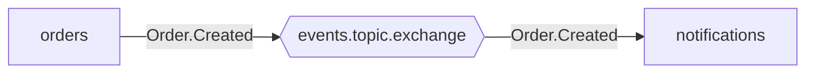

# gomessaging

<p align="center">
  <strong>Opinionated multi-transport messaging with shared specification, conformance testing, and topology visualization.</strong>
</p>

<p align="center">
  <a href="https://github.com/sparetimecoders/messaging/actions"></a>
  <a href="https://github.com/sparetimecoders/messaging/releases"></a>
  <a href="https://pkg.go.dev/github.com/sparetimecoders/messaging"></a>
  <a href="https://www.npmjs.com/package/@gomessaging/spec"></a>
  <a href="LICENSE"></a>
</p>

---

gomessaging defines a **shared specification** for event-driven microservices that works across message brokers (AMQP/RabbitMQ, NATS/JetStream) and languages (Go, Node.js/TypeScript). Services that follow the spec get:

- **Deterministic naming** &mdash; exchange, queue, and stream names derive from service name + pattern
- **Topology validation** &mdash; catch wiring errors before deployment
- **Topology visualization** &mdash; auto-generated Mermaid diagrams of your message flows
- **CloudEvents 1.0** &mdash; all messages carry standardized metadata
- **Conformance testing** &mdash; the TCK proves transport implementations are correct

> **Documentation**: See the [docs/](docs/) directory for in-depth guides on [getting started](docs/getting-started.md), [communication patterns](docs/patterns.md), [naming conventions](docs/naming.md), [CloudEvents](docs/cloudevents.md), [topology tools](docs/topology.md), and [implementing a transport](docs/implementing.md).

## Ecosystem

| Package | Language | Description |
|---------|----------|-------------|
| [`messaging`](https://github.com/sparetimecoders/messaging) | Go | Specification, TCK runner, validation, visualization |
| [`@gomessaging/spec`](https://github.com/sparetimecoders/messaging/tree/main/typescript) | TypeScript | Shared messaging library (mirrors Go) |
| [`gomessaging/amqp`](https://github.com/sparetimecoders/go-messaging-amqp) | Go | AMQP/RabbitMQ transport |
| [`gomessaging/nats`](https://github.com/sparetimecoders/go-messaging-nats) | Go | NATS/JetStream transport |
| [`@gomessaging/amqp`](https://github.com/sparetimecoders/nodejs-messaging-amqp) | TypeScript | AMQP/RabbitMQ transport |
| [`@gomessaging/nats`](https://github.com/sparetimecoders/nodejs-messaging-nats) | TypeScript | NATS/JetStream transport |

```
messaging (this repo)
  spec + tck + testdata + specverify + typescript
    ├── go-messaging-amqp    (depends on spec + tck)
    ├── go-messaging-nats    (depends on spec + tck)
    ├── nodejs-messaging-amqp (depends on @gomessaging/spec)
    └── nodejs-messaging-nats (depends on @gomessaging/spec)
```

## Quick Start

### Go

```go
import (
    "github.com/sparetimecoders/go-messaging-amqp"
    "github.com/sparetimecoders/messaging"
)

// Create a publisher
pub := amqp.NewPublisher()

// Connect and declare topology
conn, _ := amqp.NewFromURL("order-service", "amqp://localhost:5672/")
conn.Start(ctx,
    amqp.EventStreamPublisher(pub),
    amqp.EventStreamConsumer("Order.Created", func(ctx context.Context, e messaging.ConsumableEvent[OrderCreated]) error {
        fmt.Printf("Order %s from %s\n", e.Payload.OrderID, e.Source)
        return nil
    }),
)

// Publish an event
pub.Publish(ctx, "Order.Created", OrderCreated{OrderID: "abc-123", Amount: 42})
```

### Node.js / TypeScript

```typescript
import { Connection } from "@gomessaging/amqp";

const conn = new Connection({ url: "amqp://localhost:5672", serviceName: "order-service" });

const pub = conn.addEventPublisher();
conn.addEventConsumer("Order.Created", async (event) => {
  console.log(`Order ${event.payload.orderId} from ${event.source}`);
});

await conn.start();
await pub.publish("Order.Created", { orderId: "abc-123", amount: 42 });
```

The API is nearly identical across transports &mdash; swap `amqp` for `nats` and it works:

```go
conn, _ := nats.NewConnection("order-service", "nats://localhost:4222")
conn.Start(ctx,
    nats.EventStreamPublisher(pub),
    nats.EventStreamConsumer("Order.Created", handler),
)
```

## Communication Patterns

gomessaging supports five messaging patterns. All names are derived deterministically from the service name and pattern, so services discover each other without configuration.

### Event Stream (pub/sub)

The default pattern. Publish domain events to a shared topic exchange; any number of services subscribe by routing key.

```
orders ──publish──> [events.topic.exchange] ──Order.Created──> notifications
                                            ──Order.Created──> analytics
                                            ──Order.*───────> audit
```

- **Durable consumers**: survive restarts (quorum queues in AMQP, durable consumers in NATS)
- **Transient consumers**: auto-delete on disconnect, for temporary subscriptions
- **Wildcard routing**: `Order.*` matches `Order.Created`, `Order.Updated`; `Order.#` matches any depth

### Custom Stream

Same as event-stream but on a named exchange instead of the default `events` exchange. Use when events belong to a separate domain (e.g., `audit`, `telemetry`).

### Service Request-Response (RPC)

Synchronous request-reply between services:

```
caller ──> [billing.direct.exchange.request] ──> billing handler
                                                      │
caller <── [billing.headers.exchange.response] <──────┘
```

In NATS, this maps to Core NATS request-reply with built-in response routing.

### Queue Publish

Direct publish to a named queue. The sender picks the destination. Useful for work queues and task distribution.

## Naming Conventions

All resource names follow deterministic patterns. This enables topology discovery, validation, and visualization without broker-specific configuration.

### AMQP

| Resource | Pattern | Example |
|----------|---------|---------|
| Topic exchange | `{name}.topic.exchange` | `events.topic.exchange` |
| Event queue | `{exchange}.queue.{service}` | `events.topic.exchange.queue.notifications` |
| Request exchange | `{service}.direct.exchange.request` | `billing.direct.exchange.request` |
| Request queue | `{service}.direct.exchange.request.queue` | `billing.direct.exchange.request.queue` |
| Response exchange | `{service}.headers.exchange.response` | `billing.headers.exchange.response` |
| Response queue | `{target}.headers.exchange.response.queue.{caller}` | `billing.headers.exchange.response.queue.orders` |

### NATS

| Resource | Pattern | Example |
|----------|---------|---------|
| Stream | `{name}` | `events` |
| Subject | `{stream}.{routingKey}` | `events.Order.Created` |
| Consumer | `{service}` | `notifications` |

Wildcard translation: AMQP `#` (multi-level) maps to NATS `>`.

## CloudEvents

All messages carry [CloudEvents 1.0](https://cloudevents.io/) metadata in binary content mode (attributes as transport headers, payload as message body):

| Header | Value |
|--------|-------|
| `ce-specversion` | `1.0` |
| `ce-type` | routing key (e.g., `Order.Created`) |
| `ce-source` | service name (e.g., `order-service`) |
| `ce-id` | UUID v4 |
| `ce-time` | RFC 3339 UTC timestamp |
| `ce-datacontenttype` | `application/json` |

Headers are set automatically on publish. On consume, `ValidateCEHeaders()` checks for required attributes and logs warnings for missing values. Legacy messages without CE headers are enriched transparently.

AMQP uses the `cloudEvents:` prefix per the [AMQP binding spec](https://github.com/cloudevents/spec/blob/main/cloudevents/bindings/amqp-protocol-binding.md). The messaging library normalizes all prefix variants (`cloudEvents:*`, `cloudEvents_*`, `ce-*`) to the canonical `ce-` form on consume.

## Topology Validation

The messaging library provides static analysis tools for messaging topologies:

```go
import "github.com/sparetimecoders/messaging"

// Validate a single service
errors := messaging.Validate(myTopology)

// Cross-validate multiple services (consumers have matching publishers)
errors := messaging.ValidateTopologies(allTopologies)
```

Validation catches:
- Missing exchange or queue names
- Consumer endpoints without queue declarations
- Missing routing keys
- Transport-specific naming violations
- Consumers with no matching publisher across the system

## Topology Visualization

Generate Mermaid flowchart diagrams from service topologies:

```go
diagram := messaging.Mermaid(allTopologies)
```

Output:



The `specverify` CLI wraps these for command-line use:

```sh
specverify validate topology.json
specverify cross-validate order-service.json notification-service.json
specverify visualize order-service.json notification-service.json
specverify discover --url http://localhost:15672    # reconstruct from live broker
```

## Observability

All transport implementations share the same observability contracts:

### Tracing (OpenTelemetry)

- Consumer and publisher spans with `messaging.system`, `messaging.operation`, `messaging.destination.name`
- Context propagation via `TextMapPropagator` (trace context flows through message headers)
- Configurable span naming

### Metrics (Prometheus)

| Metric | Type | Description |
|--------|------|-------------|
| `{transport}_events_received` | counter | Events received |
| `{transport}_events_ack` | counter | Events acknowledged |
| `{transport}_events_nack` | counter | Events rejected |
| `{transport}_events_processed_duration` | histogram | Processing time |
| `{transport}_events_publish_succeed` | counter | Successful publishes |
| `{transport}_events_publish_failed` | counter | Failed publishes |
| `{transport}_events_publish_duration` | histogram | Publish time |

### Structured Logging

Go transports use `log/slog`; Node.js transports accept a logger interface. Both include routing key, service name, and message ID in log context.

## Technology Compatibility Kit (TCK)

The TCK is a rigorous, tamper-resistant conformance test suite. It verifies that transport implementations correctly handle all messaging patterns by running real messages through a real broker.

### How It Works

The TCK runner (Go) communicates with transport adapters via a [JSON-RPC subprocess protocol](testdata/TCK-PROTOCOL.md):

```
TCK Runner (Go)                    Transport Adapter (any language)
      │                                       │
      │──── hello ───────────────────────────>│
      │<─── {protocolVersion, brokerConfig} ──│
      │                                       │
      │──── start_service ───────────────────>│
      │<─── {topology, publisherKeys} ────────│
      │                                       │
      │──── publish ─────────────────────────>│
      │──── received ────────────────────────>│
      │<─── {messages} ──────────────────────│
      │                                       │
      │──── shutdown ────────────────────────>│
```

### Five-Phase Verification

Each scenario runs through five phases:

1. **Setup** &mdash; Start services with randomized names (prevents hardcoding)
2. **Topology** &mdash; Verify declared exchanges, queues, streams match expected values
3. **Broker State** &mdash; Query the broker directly to confirm actual resource creation
4. **Delivery** &mdash; Publish messages and verify correct delivery with payload + metadata matching
5. **Probes** &mdash; Cross-validate by injecting raw messages into the broker and verifying receipt (and vice versa)

### Anti-Tampering

- Service names are randomized with a nonce suffix at runtime
- Each message payload includes a unique `_tckNonce` field
- Probe phase bypasses the implementation entirely, talking directly to the broker

### Coverage Matrix

The TCK tracks which (pattern, direction, ephemeral) combinations are exercised, identifying gaps in test coverage.

### Running the TCK

```sh
cd tck
go run ./cmd/tck-runner/ --adapter ../path/to/adapter-binary
```

### Writing a TCK Adapter

Implement the [JSON-RPC protocol](testdata/TCK-PROTOCOL.md) in your language. The Go `adapterutil` package provides a reusable handler:

```go
import "github.com/sparetimecoders/messaging/tck/adapterutil"

func main() {
    mgr := &myServiceManager{url: os.Getenv("RABBITMQ_URL")}
    adapterutil.Serve("amqp", brokerConfig, mgr)
}
```

See the transport repos for complete adapter examples:
- [Go AMQP adapter](https://github.com/sparetimecoders/go-messaging-amqp/tree/main/cmd/tck-adapter)
- [Go NATS adapter](https://github.com/sparetimecoders/go-messaging-nats/tree/main/cmd/tck-adapter)
- [Node AMQP adapter](https://github.com/sparetimecoders/nodejs-messaging-amqp/tree/main/tck-adapter)
- [Node NATS adapter](https://github.com/sparetimecoders/nodejs-messaging-nats/tree/main/tck-adapter)

## Shared Test Fixtures

JSON fixtures in [`testdata/`](testdata/) define expected behavior for all implementations:

| File | What It Tests |
|------|--------------|
| [`constants.json`](testdata/constants.json) | Exchange kinds, patterns, directions, CE header names |
| [`naming.json`](testdata/naming.json) | Naming function outputs for all patterns and transports |
| [`validate.json`](testdata/validate.json) | Single-service and cross-service validation rules |
| [`topology.json`](testdata/topology.json) | Endpoint generation from setup intents |
| [`cloudevents.json`](testdata/cloudevents.json) | CE header validation, metadata extraction, normalization |
| [`tck.json`](testdata/tck.json) | Multi-service integration scenarios with message flows |

Fixtures are generated from Go source and are the canonical specification:

```sh
go test -run TestGenerateFixtures ./...
```

## Implementing a New Transport

To create a conformant transport in any language:

1. **Port the spec** &mdash; implement naming functions and types from this module (or use the shared JSON fixtures)
2. **Pass fixture tests** &mdash; load `testdata/*.json` and verify identical outputs
3. **Map patterns to broker primitives:**

   | Pattern | AMQP | NATS |
   |---------|------|------|
   | event-stream | topic exchange + durable queues | JetStream stream + durable consumers |
   | custom-stream | named topic exchange | named JetStream stream |
   | service-request | direct exchange | Core NATS request-reply |
   | service-response | headers exchange | Core NATS reply subject |
   | queue-publish | default exchange + named queue | Core NATS publish |

4. **Add CloudEvents** &mdash; set required CE headers on publish, validate on consume
5. **Add observability** &mdash; OpenTelemetry spans and Prometheus metrics following the conventions above
6. **Export topology** &mdash; implement `Topology()` so topologies can be validated/visualized without a broker
7. **Write a TCK adapter** &mdash; implement the subprocess protocol and pass all TCK scenarios

## Project Structure

```
.
├── *.go                  Go shared library (naming, topology, validation, CloudEvents, visualization)
├── spectest/             Conformance test helpers and assertion functions
├── tck/                  Technology Compatibility Kit (runner, protocol, broker access)
│   ├── adapterutil/      Reusable JSON-RPC handler for adapter implementations
│   └── cmd/tck-runner/   TCK CLI runner
├── specverify/           CLI for topology validation and visualization
├── testdata/             Shared JSON test fixtures (canonical specification)
├── typescript/           TypeScript shared messaging library (mirrors Go)
├── ARCHITECTURE.md       System design overview
└── GAPS.md               Open spec gaps
```

## Development

```sh
# Run spec tests
go test ./...

# Run TCK (requires running brokers)
cd tck && docker compose up -d
go run ./cmd/tck-runner/ --adapter path/to/adapter

# Regenerate fixtures
go test -run TestGenerateFixtures ./...

# Node.js spec tests
cd typescript && npm install && npm test
```

## License

MIT
