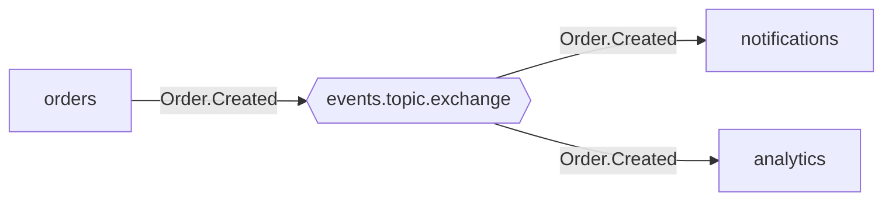
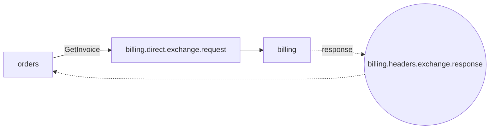

# Topology Tools

gomessaging provides static analysis and visualization tools for messaging topologies. Catch wiring errors before deployment, generate architecture diagrams, and reconstruct topologies from a live broker.

## Topology Model

A **topology** describes all the messaging endpoints declared by a single service:

```json
{
  "transport": "amqp",
  "serviceName": "notifications",
  "endpoints": [
    {
      "direction": "consume",
      "pattern": "event-stream",
      "exchangeName": "events.topic.exchange",
      "exchangeKind": "topic",
      "queueName": "events.topic.exchange.queue.notifications",
      "routingKey": "Order.Created",
      "messageType": "OrderCreated",
      "ephemeral": false
    }
  ]
}
```

Transport implementations export their topology via a `Topology()` method, making validation and visualization possible without connecting to a broker.

## Validation

### Single-Service Validation

Check structural correctness of one service's topology:

```go
import "github.com/sparetimecoders/messaging"

errors := messaging.Validate(topology)
```

Catches:
- Empty service name
- Missing exchange name
- Consume endpoints without a queue name (unless ephemeral)
- Missing routing key for topic/direct exchanges
- Transport-specific naming violations (e.g., AMQP topic exchange not ending in `.topic.exchange`)
- NATS names containing AMQP suffixes or whitespace

### Cross-Service Validation

Verify that consumers have matching publishers across the entire system:

```go
errors := messaging.ValidateTopologies([]messaging.Topology{orders, notifications, analytics})
```

Catches everything from single-service validation plus:
- Consumer routing keys with no matching publisher on the same exchange
- Transport mismatches (AMQP consumers can't receive from NATS publishers)

Exact-match consumers (no wildcards) are validated strictly. Wildcard consumers (`Order.*`, `#`) are expected to match multiple publishers and are not flagged.

## Visualization

Generate [Mermaid](https://mermaid.js.org/) flowchart diagrams from service topologies:

```go
diagram := messaging.Mermaid([]messaging.Topology{orders, notifications, analytics})
```

Output:



### Diagram Conventions

| Element | Shape | Meaning |
|---------|-------|---------|
| Service | Rectangle (pink) | A microservice |
| Topic exchange | Hexagon (blue) | Pub/sub routing |
| Direct exchange | Rectangle (blue) | Point-to-point routing |
| Headers exchange | Circle (blue) | Header-based routing |
| Solid arrow | `-->` | Publish or consume |
| Dotted arrow | `-.->` | Response channel |

When multiple transports are present, exchanges are grouped into labeled subgraphs.

### Request-Response Example



## Broker Discovery

Reconstruct topologies from a live RabbitMQ broker using the Management API:

```go
topologies, err := messaging.DiscoverTopologies(messaging.BrokerConfig{
    URL:      "http://localhost:15672",
    Username: "guest",
    Password: "guest",
    Vhost:    "/",
})
```

Discovery:
1. Fetches all exchanges, queues, and bindings from the broker
2. Infers service names from queue naming conventions
3. Determines patterns (event-stream, service-request, etc.) from exchange types
4. Returns sorted `[]Topology` matching the same format used by validation and visualization
5. Filters out internal `amq.*` exchanges

This is useful for auditing existing deployments, generating architecture diagrams from production, or bootstrapping topology files for validation.

## specverify CLI

The `specverify` command-line tool wraps all topology operations:

```sh
# Validate a single service topology
specverify validate topology.json

# Cross-validate multiple services
specverify cross-validate order-service.json notification-service.json

# Generate Mermaid diagram
specverify visualize order-service.json notification-service.json

# Discover topologies from a live broker
specverify discover --url http://localhost:15672 --user guest --pass guest
```

### Topology File Format

The CLI reads JSON files matching the `Topology` struct:

```json
{
  "transport": "amqp",
  "serviceName": "order-service",
  "endpoints": [
    {
      "direction": "publish",
      "pattern": "event-stream",
      "exchangeName": "events.topic.exchange",
      "exchangeKind": "topic",
      "routingKey": "Order.Created",
      "messageType": "OrderCreated"
    },
    {
      "direction": "consume",
      "pattern": "event-stream",
      "exchangeName": "events.topic.exchange",
      "exchangeKind": "topic",
      "queueName": "events.topic.exchange.queue.order-service",
      "routingKey": "Payment.Completed",
      "messageType": "PaymentCompleted"
    }
  ]
}
```

### CI Integration

Run topology validation in CI to prevent deployment of broken wiring:

```yaml
- name: Validate messaging topology
  run: |
    specverify cross-validate services/*/topology.json
```

Any validation error returns a non-zero exit code.
